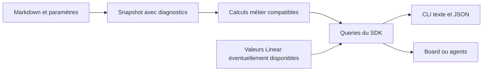

# Pilotage calculé : retrouver les lectures de Linear dans la CLI

29 septembre 2026. Cible : **reprendre les usages et règles de calcul Linear sur le périmètre retenu**, sans substituer des indicateurs Frame portant les mêmes noms. Code inspecté : `451914f`. Cette révision remplace les formules proposées précédemment ; aucune query nouvelle n'est implémentée ici.

Le [modèle local](01-modele-local.md) fournit les données. Les [services actifs](03-services-actifs.md) déclenchent les actions. Les commandes ci-dessous sont une interface cible, pas des commandes toutes disponibles.

## 1. Quels usages rendre possibles

| Usage Linear à retrouver | Manque Frame actuel | CLI cible | Valeur |
|---|---|---|---|
| Vue projet : scope, commencé, terminé, jalons | Pas de synthèse native | `frame project show PROJ-0001 --progress` | Voir l'état d'un livrable sans ouvrir tous les fichiers |
| Progression et jalon courant | Statuts de jalon manuels | `frame milestone list --project PROJ-0001 --progress` | Identifier l'étape actuelle et le travail restant |
| Vue initiative et santé des projets | Pas d'initiative | `frame initiative show INIT-0001 --include-descendants` | Revoir un objectif transverse |
| Cycle courant : scope, progression, succès | Pas de cycles ni historique d'engagement | `frame cycle show CYCLE-0001 --progress` | Suivre l'engagement de l'équipe |
| My issues, backlog, triage | Filtres simples et pas d'équipe | `frame issue list --assignee me --team ENG` | Commencer sa journée dans la CLI |
| Vues sauvegardées | Filtres non sauvegardés | `frame view run VIEW-0001` | Réutiliser une sélection partagée |
| Recherche et relations | Pas de recherche globale native | `frame search "invitation" --type issue` | Retrouver et comprendre le travail |
| Insights | Pas de mesures de flux | `frame insights --team ENG --metric cycle-time` | Identifier les attentes et changements de débit |
| Prévision de projet | Pas de prévision | `frame project forecast PROJ-0001` | Comparer rythme observé et cible |

L'affichage terminal peut être un tableau ou du JSON ; il ne demande pas de reproduire une timeline graphique. Un futur Board consommera les mêmes résultats. Références : [Project graph](https://linear.app/docs/project-graph), [Project milestones](https://linear.app/docs/project-milestones), [Cycle graph](https://linear.app/docs/cycle-graph), [Views](https://linear.app/docs/custom-views), [Insights](https://linear.app/docs/insights).

## 2. Principe de fidélité des calculs

Chaque mesure expose sa définition, son périmètre et sa provenance. Trois modes à distinguer :

| Mode | Signification | Affichage attendu |
|---|---|---|
| Valeur distante | Résultat fourni par Linear, lorsque accessible via l'API | Source Linear et date de récupération |
| Calcul local validé | Même comportement vérifié sur des cas de référence | Définition/version et périmètre local |
| Comportement non validé | Formule ou cas limite non établis | Indicateur indisponible ou explicitement expérimental |

Un résultat distant n'est plus actuel si le travail a changé localement depuis la synchronisation. Ne pas afficher côte à côte un pourcentage ancien comme s'il décrivait les nouvelles issues. Conserver révision de source, paramètres d'équipe, période et avertissements.

Le but n'est pas de renoncer aux calculs locaux : c'est de ne pas déclarer une parité numérique avant de l'avoir vérifiée. Le détail des coefficients non publiés constitue une limite à résoudre, pas une liberté de les inventer.

## 3. Estimations : reprendre les réglages d'équipe

Linear permet l'activation et le choix d'échelle par équipe, y compris dans un projet multiéquipe. Sans estimations activées, une issue vaut un point pour les statistiques. Une issue non estimée peut compter un point selon le réglage d'équipe ; zéro est une valeur distincte. Les tailles de vêtements sont converties selon l'échelle Fibonacci. Source : [Estimates](https://linear.app/docs/estimates).

**Conséquence :** abandonner notre proposition précédente qui calculait systématiquement le pourcentage seulement sur les issues explicitement estimées. Elle ne reproduirait pas Linear. Le calcul doit résoudre la politique effective pour chaque issue, y compris les paramètres hérités.

```sh
frame team show ENG --estimates
frame project show PROJ-0001 --progress --explain
```

Une explication doit distinguer points explicites, valeur appliquée aux non-estimées et mode sans estimation. Les anciennes estimations Frame en heures demandent un mapping explicite ; ne pas les mélanger automatiquement avec les points du modèle cible.

**Validation nécessaire :** estimations désactivées, non-estimée, zéro autorisé/interdit, échelle étendue, paramètres hérités et équipes aux réglages différents. La version des réglages utilisés appartient au contexte d'une série historique.

## 4. Projet : scope, commencé, terminé et historique

Linear présente séparément le périmètre, le travail commencé et le travail terminé ; les évolutions du périmètre influencent le graphe. La prévision repose sur un historique hebdomadaire. Source : [Project graph](https://linear.app/docs/project-graph).

La CLI doit donc rendre ces informations distinctes et permettre de voir les issues sources :

```sh
frame project show PROJ-0001 --progress --json
frame issue list --project PROJ-0001 --status-category started
frame issue list --project PROJ-0001 --group-by milestone
frame project history PROJ-0001 --since 2026-10-01 --changes scope
```

**À implémenter.** Un résumé courant, puis une série historisée des ajouts, retraits, estimations et changements d'état. Le stock actuel de fichiers ne reconstitue pas fidèlement le passé ; il faut des événements ou snapshots datés fiables.

**À ne pas imposer arbitrairement.** Pas de politique « seules les feuilles comptent », ni d'exclusion systématique des archives, ni de pondération inventée des états intermédiaires. Vérifier le comportement Linear pour parents/sous-issues, doublons, annulations, suppressions, transferts et réouvertures. Les filtres d'affichage ne doivent pas modifier silencieusement la définition de la mesure.

Un tableau local de nombres bruts par catégorie reste utile pendant cette validation, à condition de le nommer comme tel. Le taux de travail livré ne mesure pas automatiquement l'atteinte d'un résultat business.

**Valeur.** Une revue de projet peut expliquer ce qui a avancé et ce qui a grossi. **Preuve attendue :** mêmes objets et paramètres produisent les mêmes totaux que le scénario de référence, et un changement de scope reste visible.

## 5. Jalons : progression issue du travail

Linear calcule une progression de jalon qui commence à augmenter dès que des issues passent dans une catégorie started ; la complétion augmente ensuite cette progression. Le prochain jalon incomplet est mis en avant. La page consultée ne donne pas tous les coefficients numériques. Source : [Project milestones](https://linear.app/docs/project-milestones).

**Correction de la proposition précédente :** ne pas remplacer cette lecture par « uniquement les issues terminées » ni par le statut manuel `pending/active/done` de Frame. Ne pas reprendre automatiquement le coefficient des cycles pour les jalons sans vérification.

```sh
frame milestone list --project PROJ-0001 --progress
frame milestone show MILE-0001 --issues --explain
```

Afficher le périmètre, les catégories et la date cible immédiatement ; afficher le pourcentage conforme seulement après validation de la formule ou lecture d'une valeur distante exposée. Un jalon sans issues doit avoir le comportement Linear vérifié, pas être déclaré terminé par convention locale.

**Valeur.** Voir quelle phase du projet avance réellement. **Preuve attendue :** vide, started, completed, réouverture, déplacement d'issue et jalons menés en parallèle.

## 6. Initiatives : consolider sans dupliquer

```sh
frame initiative show INIT-0001 --tree
frame initiative show INIT-0001 --projects --include-descendants
frame initiative show INIT-0001 --health
frame update list --initiative INIT-0001 --include-descendants
```

Résoudre projets directs et projets des sous-initiatives, avec une identité unique par projet dans une vue consolidée. Plusieurs chemins dans un graphe ne représentent pas plusieurs projets. Le réglage « directs seulement » doit rester disponible.

Montrer santé déclarée de l'initiative, distribution de santé des projets, publications récentes et absence d'update. Ne pas calculer une santé globale comme moyenne de pourcentages, ni écraser la santé publiée par un score de risque. Sources : [Initiatives](https://linear.app/docs/initiatives), [Sub-initiatives](https://linear.app/docs/sub-initiatives), [Updates](https://linear.app/docs/initiative-and-project-updates).

**Valeur.** Préparer une revue de programme depuis le terminal. **Preuve attendue :** graphe multiparent, projet accessible par deux chemins, projet sans update et distinction entre composition directe et descendants.

## 7. Cycles : adopter les indicateurs de Linear

Le graphe de cycle distingue scope, commencé et terminé. Le succès du cycle accorde un crédit de 25 % aux issues commencées et compte entièrement les issues terminées. Exemple officiel : 5 terminées, 4 commencées et 1 non commencée donnent 60 %. Source : [Cycle graph](https://linear.app/docs/cycle-graph).

```sh
frame cycle current --team ENG
frame cycle show CYCLE-0001 --progress --explain
frame issue list --cycle CYCLE-0001 --group-by status
frame cycle history CYCLE-0001 --changes scope
```

Ne pas appeler cet indicateur « taux de complétion » : le travail commencé n'est pas livré. Lorsque les estimations sont activées, valider l'application exacte de la pondération et des réglages sur chaque mesure ; la formule d'une vue ne doit pas être généralisée à toutes les autres.

Conserver le périmètre et les affectations dans le temps, afin de montrer ajouts, retraits et reports. Linear a aussi un comportement de rattachement des complétions tardives avant le démarrage du cycle suivant ; les frontières temporelles et le cooldown doivent être testés. La capacité affichée doit reprendre la définition Linear plutôt qu'un budget Frame inventé. Sources : [Cycles](https://linear.app/docs/use-cycles), [Cycle graph](https://linear.app/docs/cycle-graph).

**Valeur.** Reprendre les mêmes repères de planification dans Linear et dans Frame. **Preuve attendue :** occurrence sans issues, report, cooldown, complétion tardive, paramètres d'estimation et fuseau d'équipe.

## 8. Vues, filtres, recherche et travail personnel

```sh
frame issue list --assignee me --sort priority --group-by project
frame issue list --team ENG --status-category backlog
frame issue list --team ENG --status-category triage
frame issue list --project PROJ-0001 --due overdue
frame view save --name "Mes urgences" --from-query ./mes-urgences.json
frame view run VIEW-0001 --json
frame search "invitation" --type document
```

Le filtre sauvegardé représente les propriétés et opérateurs pris en charge, y compris groupes AND/OR utiles, sans nouveau langage de programmation. Le format de stockage JSON/YAML est propre à Frame ; sa sémantique et son mapping doivent rester compatibles. Les vues dynamiques ne possèdent pas les objets.

Résoudre `me` au moment de l'exécution. Distinguer vues partagées, préférences personnelles et filtres ponctuels. Préserver l'ordre manuel dans une même priorité ; ne pas le remplacer systématiquement par la date de création. Sources : [Filters](https://linear.app/docs/filters), [Views](https://linear.app/docs/custom-views), [My issues](https://linear.app/docs/my-issues), [Priority](https://linear.app/docs/priority), [Search](https://linear.app/docs/search).

**Valeur.** Les mêmes sélections servent à l'humain, à l'agent et à une interface future. **Preuve attendue :** mêmes IDs et ordre, valeurs nulles, labels de même nom mais de scopes différents, objets archivés et résolution des identités.

## 9. Dépendances et recommandations d'exécution

```sh
frame issue show ENG-101 --relations
frame project show PROJ-0001 --dependencies
frame next --team ENG --explain
```

Les deux premières commandes rendent des relations du modèle commun. `next`, les claims et le brief sont des commodités Frame : les documenter comme telles, sans les faire passer pour des fonctions Linear.

La sélection d'un agent peut ignorer les issues déjà réservées ou bloquées selon sa politique. Elle ne doit ni changer les statuts importés ni rendre obligatoire une contrainte de gates absente du contrat commun. Une dépendance externe inconnue reste signalée comme inconnue. Les « issues débloquées » doivent distinguer dépendantes directes et travail réellement exécutable après satisfaction de tous les prérequis.

**Valeur.** Préserver l'utilité de Frame pour les agents sans détourner les objets Linear.

## 10. Insights et prévisions : ne pas promettre une équivalence opaque

Les métriques de flux doivent reprendre les définitions Linear retenues et leurs fenêtres : temps de cycle, débit, catégories et dates de transition. Les traces actuelles ne garantissent pas tous les événements nécessaires, notamment après édition manuelle. Source fonctionnelle : [Insights](https://linear.app/docs/insights).

```sh
frame insights --team ENG --metric cycle-time --since 2026-10-01 --explain
frame project forecast PROJ-0001 --explain
```

La documentation du graphe projet indique au moins une semaine d'historique, une vitesse hebdomadaire donnant plus de poids aux semaines récentes, un traitement spécifique du travail en cours et une fourchette d'environ ±40 %. Elle ne suffit pas à déduire chaque coefficient interne. Source : [Project graph](https://linear.app/docs/project-graph).

Ne pas remplacer cela par une simulation différente sous le même nom. Si l'API expose la valeur, la présenter comme distante ; sinon, valider la reconstruction sur des cas comparables. Tant que cette validation manque, rendre les données de débit et l'indisponibilité de prévision explicites. Ne pas inventer des événements historiques lors d'un import.

**Valeur.** Comparer les engagements sur des bases cohérentes entre les deux produits. **Preuve attendue :** historique insuffisant, débit nul, variation du scope et réouvertures ne produisent pas une fausse date certaine.

## 11. Où intégrer les lectures



Les fonctions de calcul résident dans [core](../../packages/core/src/services/index.ts), les cas d'usage chargent le périmètre, [fs](../../packages/fs/src/realm.repository.ts) produit une lecture cohérente et [SDK](../../packages/sdk/src/frame.ts) expose les queries. [CLI](../../apps/cli/src/cli.ts) formate les résultats. Le code actuel de [next](../../packages/core/src/use-cases/get-next/get-next.ts) est une base à faire évoluer, pas la définition normative des priorités Linear.

Un résultat doit porter : identité du realm/worktree, révision du snapshot incluant les modifications non commitées, date de calcul, source locale/distante, paramètres et diagnostics. Un scan qui ignore des fichiers invalides ne peut pas annoncer une couverture complète.

Cache et index sont reconstruisibles. Les événements nécessaires à l'historique sont durables. Lire un rapport ne modifie ni le statut d'une issue ni la santé d'un projet. Le watcher ne remplace pas une réconciliation après changement de branche ou édition externe.

## 12. Critères de recalage avant livraison

Pour chaque indicateur ou vue, préparer une matrice de cas et vérifier source officielle, comportement attendu, résultat local et résultat distant quand accessible. La validation contre un workspace de test est une étape future distincte ; aucune n'a été exécutée ici.

Les points encore à établir sont visibles : pondération exacte des jalons, détails de prévision, cas limites d'archives/parents, capacité et complétions tardives des cycles. La parité ne sera revendiquée que sur les cas validés. En attendant, les comptes bruts et listes restent exploitables sans les étiqueter comme un équivalent numérique de Linear.

Cette orientation remplace les anciennes conventions Frame proposées : pourcentage limité aux seules estimations renseignées, exclusion générale des parents et crédit nul obligatoire au travail commencé. Le [comparatif initial](2026-09-29-linear-frame-gap-analysis.md) décrit l'état historique ; le présent fichier fixe la cible de fidélité.
