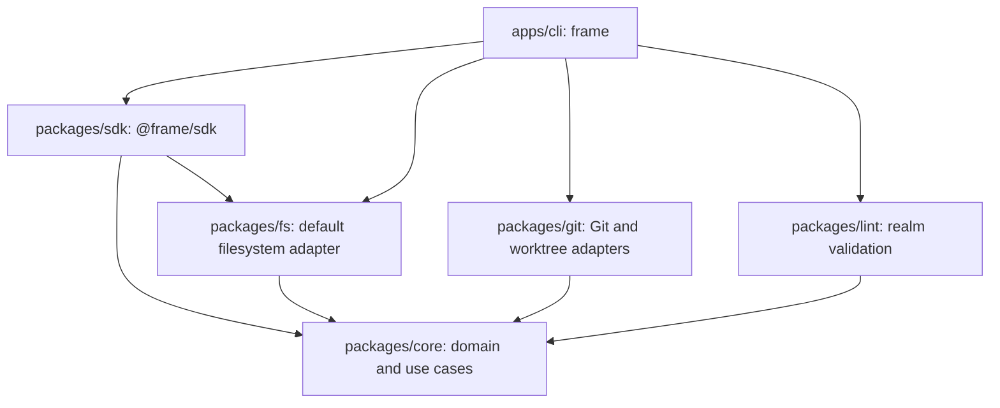

# SDK and CLI entry points

**Status:** Approved design; implementation plan not started
**Date:** 2026-09-29

## Problem statement

Frame currently ships a CLI from `packages/frame`. That package owns command
registration, command handlers, dependency assembly, format compatibility
checks, and worktree coordination. The workspace already separates the domain
and use cases (`@frame/core`), filesystem persistence (`@frame/fs`), Git
operations (`@frame/git`), and raw realm validation (`@frame/lint`), but there
is no supported programmatic API for applications that want to read or change
Frame data.

The product needs two supported user-facing entry points:

1. A TypeScript SDK for programs that manipulate Frame data.
2. The existing `frame` CLI, moved to `apps/cli` and kept behaviorally
   compatible.

An SDK consumer should be able to open a realm by path and use Frame without
writing a storage adapter. Advanced consumers should also be able to supply a
repository adapter of their own.

## Goals

- Provide a stable `@frame/sdk` API centered on `new Frame({ root })`.
- Use Frame's filesystem adapter by default and support an injected repository
  for custom storage integrations.
- Expose typed reads and mutations for all Frame entity data, plus config and
  validation operations useful to programmatic consumers.
- Make the CLI consume the same SDK operations instead of duplicating
  application assembly or bypassing use cases for entity operations.
- Move CLI-owned code to `apps/cli` and preserve the `frame` command's public
  behavior.
- Keep two documented product entry points: `@frame/sdk` and `frame`.

## Non-goals

- Add a dynamic plugin loader or runtime adapter discovery.
- Add remote synchronization, a TUI, or a new storage format.
- Move Git worktree lifecycle into the general-purpose SDK.
- Change command names, flags, output formats, realm formats, or existing
  business rules as part of the package split.
- Publish or push implementation changes as part of this design.

## User stories

1. As a TypeScript application developer, I can open a Frame realm by passing
   its root path and list or mutate its entities without assembling internal
   use cases.
2. As an integration developer, I can supply a repository implementation and
   use the same Frame operations against custom storage.
3. As a CLI user, I keep the current `frame` command behavior while its data
   operations use the shared SDK.
4. As a maintainer, I can find SDK, CLI, domain, persistence, Git, and lint
   responsibilities at explicit package boundaries.

## Package architecture

The workspace will include `packages/*` and `apps/*`.

| Location | Responsibility | Dependency direction |
| --- | --- | --- |
| `packages/core` | Domain entities, value objects, domain services, application use cases, repository ports, and domain errors | No workspace dependencies |
| `packages/fs` | Filesystem repository, `.frameconfig` access, manifest and state management, templates, parsers, serializers, and raw scans | `@frame/core` |
| `packages/git` | Git staging and worktree adapters | `@frame/core` |
| `packages/lint` | Structural validation of raw realm scans | `@frame/core` |
| `packages/sdk` | Public `Frame` class, typed data API, lazy setup, and default filesystem-adapter composition | `@frame/core`, `@frame/fs` |
| `apps/cli` | The `frame` executable, command registration and handlers, terminal output and exit behavior, worktree claims, and local Git orchestration | `@frame/sdk`, `@frame/git`, `@frame/lint`, `@frame/fs` as needed for CLI-only operations |

Dependency flow:



`@frame/sdk` and `frame` are the two documented product entry points. The SDK
depends on installable `@frame/core` and `@frame/fs` support packages. Their
exports are implementation support for the SDK; user-facing documentation
should direct integrations to `@frame/sdk`. The CLI build must include its
`git` and `lint` implementation dependencies so the published `frame` binary
does not require consumers to install undocumented private workspace packages.
The implementation plan must select and validate the exact build and
declaration packaging mechanism for this distribution contract.

## SDK API and lifecycle

The normal use is:

```ts
import { Frame } from "@frame/sdk";

const frame = new Frame({ root: "/path/to/repository" });
const issues = await frame.issues.list({ projectId: "PROJ-0001" });
```

When given `{ root }`, `Frame` composes the built-in `FsRealmRepository`, reads
`.frameconfig`, and checks realm format compatibility using existing Frame
rules. Loading is asynchronous and occurs once on first use; the constructor
does not perform synchronous filesystem work. SDK operations are asynchronous
and return domain values or structured reports. They never print output or
terminate the process.

The SDK also accepts a custom repository adapter. The SDK exports the stable
repository contract and the public types required to implement it. When a
custom repository is supplied, configuration is separately injectable; absent
an explicit config, the SDK uses `DEFAULT_CONFIG`. This keeps the filesystem
root path and `.frameconfig` behavior specific to the built-in adapter.

The API is organized by domain (`projects`, `milestones`, `issues`, `specs`,
and `traces`) and includes:

- Entity list and detail reads, including project-scoped reads.
- Existing create, edit, delete, start, complete, and status operations.
- Issue gate mutation and trace reads, currently accessed directly by CLI
  handlers where no dedicated use case exists.
- `next`, `context`, `history`, and `brief` queries.
- Typed configuration reads and the currently supported safe configuration
  updates.
- Realm validation returning a report rather than a process exit code.
- An SDK initialization operation for Frame data: `.frame/`, format manifest,
  counters, templates, and initial `.frameconfig`.

The CLI-facing `frame init` command composes SDK initialization with local
developer-tool setup. Git exclude changes, hook installation, and writing the
`AGENTS.md` guide remain CLI concerns.

## CLI boundary

The current `packages/frame` implementation moves to `apps/cli`, preserving
the published package name `frame`, command tree, flags, descriptions, human
and JSON output, and exit semantics.

CLI handlers use SDK methods for entity reads and mutations. The CLI retains
terminal formatting, Commander registration, JSON error reporting, process
exit behavior, `doctor --fix`, and worktree claims and Git coordination. Raw
realm scanning and lint report production may be called through the SDK's
validation surface; CLI-specific formatting and exit-on-error remain in the
CLI.

## Error behavior

- SDK methods reject with typed Frame/domain errors for invalid transitions,
  missing entities, failed gates, and incompatible realm formats.
- Filesystem and custom-adapter failures propagate as errors with their cause
  preserved; the SDK does not convert failures into console output or exit
  codes.
- Validation returns findings as data, including error and warning counts.
- The CLI remains responsible for mapping SDK errors to the established
  human/JSON error format and process exit status.
- Initialization is explicit. Constructing `Frame` does not write realm files
  or install Git hooks.

## Compatibility and migration

- Existing on-disk `.frame` and `.frameconfig` formats remain unchanged.
- Existing CLI invocation behavior is preserved; `FRAME_ROOT` continues to be
  resolved by the CLI and passed as a root path to the SDK.
- The CLI's command registration and handlers move without changing flags or
  output contracts, except where required to call the SDK API.
- Workspace scripts, TypeScript path aliases, root build order, clean scripts,
  tests, and package manifests are updated to include `apps/cli` and
  `packages/sdk`.
- The existing `frame` package remains the CLI distribution. The SDK is
  published as `@frame/sdk`; its support dependencies are released in a
  compatible version set.

## Verification plan

- SDK tests cover the public `Frame` API against a temporary filesystem realm,
  explicit initialization, config behavior, format compatibility, validation,
  and a custom in-memory repository adapter.
- Existing core, filesystem, Git, lint, and CLI tests remain green.
- CLI regression tests protect command registration, options, text and JSON
  output, errors, and process exit behavior during the move.
- Package checks verify workspace resolution, declaration generation,
  package contents, and installability of the SDK and CLI from packed
  artifacts without relying on workspace-only `workspace:*` dependencies.
- Run the repository gates: build, test, typecheck, and lint. Keep runtime
  package-install evidence separate from static type/build evidence.

## Open implementation decisions

These are implementation details to settle in the plan, not changes to the
approved product direction:

1. Select a package build and declaration bundling approach that provides
   installable `@frame/sdk` and `frame` artifacts while keeping `core`, `fs`,
   `git`, and `lint` as support packages rather than additional documented
   product entry points.
2. Define exact method names and input/result types for the domain namespaces,
   preserving existing use-case semantics and ID validation.
3. Decide the precise division between an SDK validation report and the
   CLI-specific `doctor --fix` repair algorithm.
4. Choose the versioning and release sequence for SDK support packages and
   the CLI artifact.
